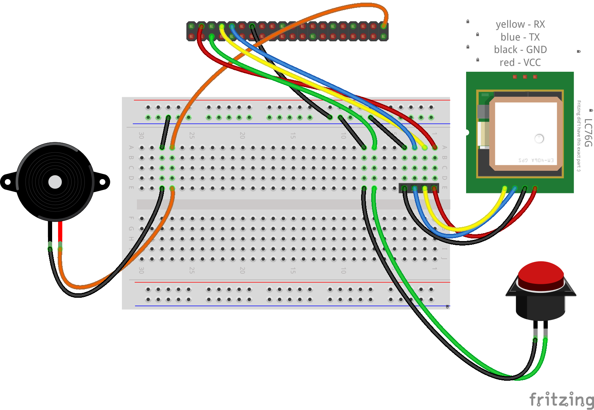
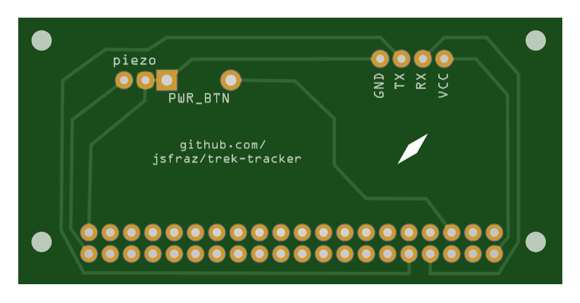
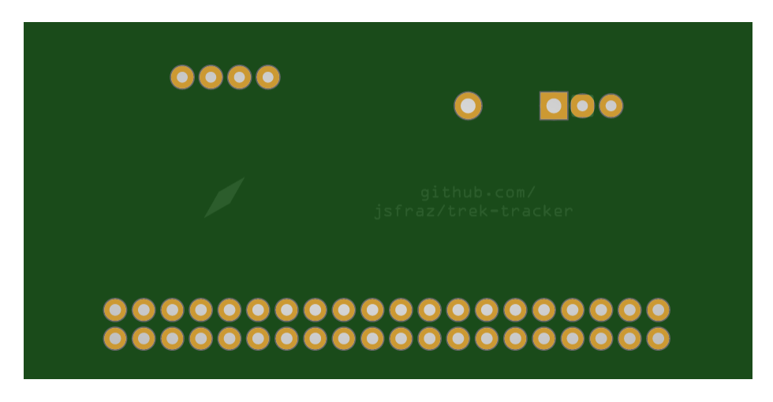
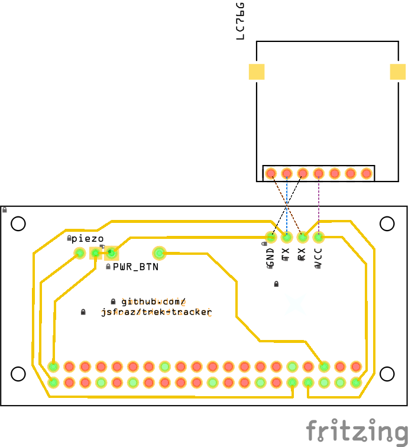

# trek-tracker

Tracker for the Trek project.

> [!TIP]
> You can read more about this project on my [blog](https://blog.josefraz.cz/how-i-created-my-own-gps-tracking-device-for-motorcycle-trips/).

- [Server](https://github.com/jsfraz/trek-server)
- [Client](https://github.com/jsfraz/trek-client)
<!--
- Visit an [instructable](TODO) to show how to build and configure the tracker.
-->
- [Wiki](https://github.com/jsfraz/trek-tracker/wiki)

## Used GPS module

- [Waveshare LC76G](https://www.waveshare.com/wiki/LC76G_GNSS_Module)

## 3D printed case

Model created in [Blender](https://www.blender.org/), snapshot captured using [MeshLab](https://www.meshlab.net/).

## Shield

Created in [Fritzing](https://fritzing.org/).

### Sketch

### PCB

Screenshot from [PCBWay online gerber viewer](https://www.pcbway.com/project/OnlineGerberViewer.html).

<!--
### Schema

-->
