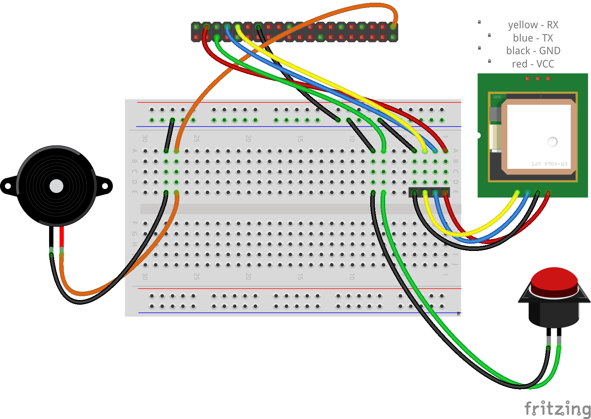
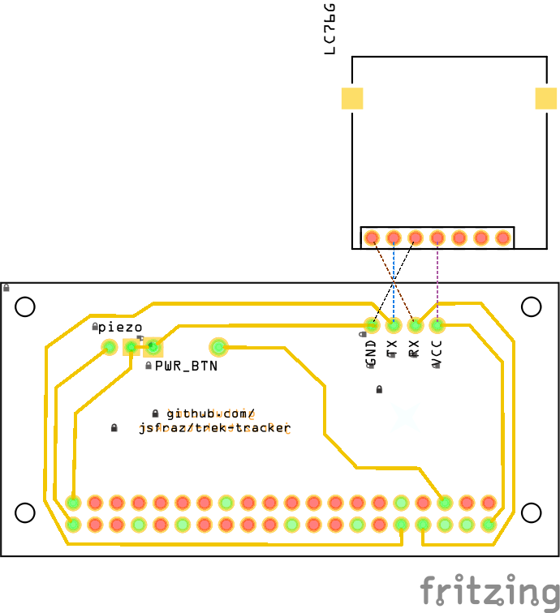

# trek-tracker

Trek tracker for tracking your motorcycles or whatever.

## Used GPS module

- [Waveshare LC76G](https://www.waveshare.com/wiki/LC76G_GNSS_Module)

## Building and installing

```bash
dpkg-deb -b . trek-tracker-1.0.0.deb
sudo dpkg -i trek-tracker-1.0.0.deb
```

Or you can download and install the package from [Releases](https://github.com/jsfraz/trek-tracker/releases).

### Power on/power off button

To enable powering off with the button you MUST add `dtoverlay=gpio-shutdown` in the end of `/boot/config.txt` file.

## Shield

### Sketch



### PCB


